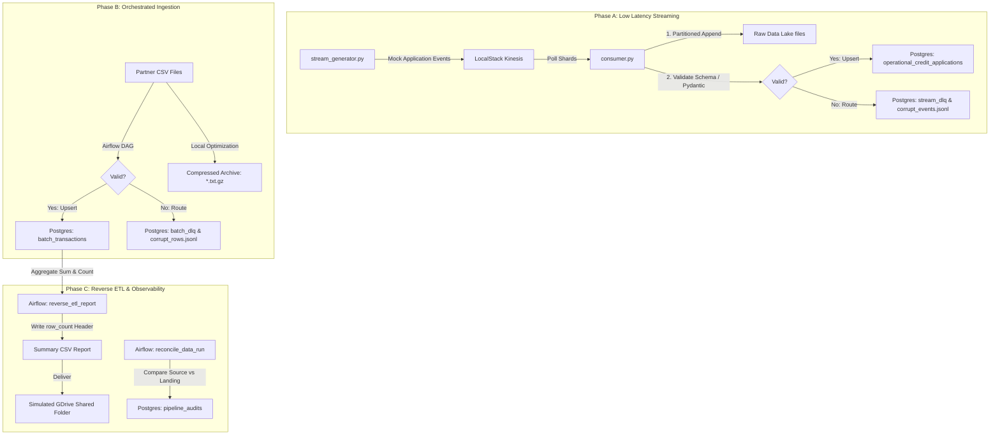

# Senior Data Engineer Challenge

## Real-Time Event Processing & Resilient Reverse ETL Simulation

This repository contains a local, fully reproducible prototype demonstrating engineering control over both real-time streaming and orchestrated batch data pipelines. The solution is built with dockerized services, rigorous schema validation, and pipeline observability.

---

## 🏗️ Architectural Flow



---

## 🚀 Quick Start Guide

### 1. Spin up the Stack
Start the database, LocalStack (Kinesis), Apache Airflow, stream generator, and stream consumer services in the background:
```bash
docker compose up -d
```
*Note: We pinned LocalStack to version `3.4.0` so that it runs successfully offline without requiring an enterprise auth token.*

### 2. Grant Local Directory Permissions
Grant write access to the shared data directory for the Airflow and consumer containers:
```bash
chmod -R 777 data
```
*(The sample transaction files are already present under `data/partner_transactions/partner_transactions_day_*.txt`)*

### 3. Monitor Streaming Ingestion
The stream generator and stream consumer run automatically. You can monitor their real-time execution logs:
```bash
# Monitor the event generator (shows dispatching of simulated applications)
docker compose logs -f stream-generator

# Monitor the consumer (shows schema validation, writing to database and data lake)
docker compose logs -f stream-consumer
```

### 4. Run the Orchestrated Batch Pipeline
1. Access the Airflow UI at `http://localhost:8080` (credentials: `admin` / `admin`).
2. Locate the `partner_financials_pipeline` DAG and click **Unpause** (the toggle button).
3. Trigger a manual DAG run to ingest the transaction files, archive them, run reconciliation, and deliver the Reverse ETL report.

---

## 🗃️ Observability & Telemetry Data Models

All pipeline metadata, isolation events, and audits are tracked in PostgreSQL:

### 1. `pipeline_audits`
Tracks execution status, timings, record tallies, and stack traces:
```sql
CREATE TABLE pipeline_audits (
    audit_id SERIAL PRIMARY KEY,
    pipeline_name VARCHAR(50) NOT NULL,            -- 'streaming_consumer' or 'batch_partner_transactions'
    execution_id VARCHAR(100) NOT NULL,            -- Session UUID or Airflow run_id
    start_time TIMESTAMP WITH TIME ZONE NOT NULL,
    end_time TIMESTAMP WITH TIME ZONE,
    records_processed INT DEFAULT 0,
    records_rejected INT DEFAULT 0,
    status VARCHAR(20) NOT NULL,                   -- 'RUNNING', 'SUCCESS', 'FAILED'
    error_details TEXT
);
```

### 2. `stream_dlq` & `batch_dlq`
Captures raw payloads and corresponding validation errors for troubleshooting:
```sql
CREATE TABLE stream_dlq (
    dlq_id SERIAL PRIMARY KEY,
    raw_payload TEXT NOT NULL,
    error_details TEXT NOT NULL,
    ingested_at TIMESTAMP WITH TIME ZONE DEFAULT CURRENT_TIMESTAMP
);
```

---

## 💡 Architectural Decisions & Justifications

### 1. Selection of Operational Storage Cache: PostgreSQL
For our operational cache/store, we selected **PostgreSQL** over alternative caches like Redis or DynamoDB:
* **Relational Consistency**: Batch records must be audited and aggregated. PostgreSQL provides support for complex SQL transactions and aggregations (e.g. `SUM`, `COUNT`, `SPLIT_PART`).
* **Resource Optimization**: Using a unified PostgreSQL instance to store the operational cache, analytical batch tables, and audit logs minimizes Docker memory usage for a local developer environment.
* **ACID and UPSERT Capabilities**: Using SQL UPSERT (`ON CONFLICT (id) DO NOTHING`) guarantees **idempotence** for both stream applications and batch transactions.

### 2. Data Lake Partitioning: Hourly Directory Strategy
Raw streaming payloads are written to `data/lake/year=YYYY/month=MM/day=DD/hour=HH/applications.jsonl`.
* ** डाउनस्ट्रीम Query Efficiency (Partition Pruning)**: Organizing directories by year, month, day, and hour allows downstream tools (such as Athena, Snowflake, or Spark) to prune directories during analytical loads. If a reconciliation query only needs to verify today's data, it only scans today's folder, saving $95\%+$ scan time and cost compared to checking flat, unpartitioned logs.
* **Append-Only Performance**: Appending line-by-line to a local JSONL file avoids memory overhead and ensures low-latency raw logging.

---

## 🔧 Troubleshooting Guide

### 1. Permission Denied Errors in Airflow
**Symptom**: Airflow task failed with `PermissionError: [Errno 13] Permission denied`.
**Solution**: Grant write access to host volumes:
```bash
chmod -R 777 data
```

### 2. LocalStack License Error
**Symptom**: LocalStack fails to start with exit code 55: `License activation failed! Reason: No credentials were found in the environment`.
**Solution**: Ensure that `docker-compose.yml` specifies `localstack/localstack:3.4.0` (as configured) rather than `:latest` to run without a license.

### 3. Pydantic Serialization Error
**Symptom**: Stream consumer throws `TypeError: Object of type ValueError is not JSON serializable` and gets stuck in a loop.
**Solution**: This has been patched. The validation exceptions are formatted as clean strings using `str(ve)` instead of `json.dumps(ve.errors())` to prevent serializer failures from blocking stream iterators.
